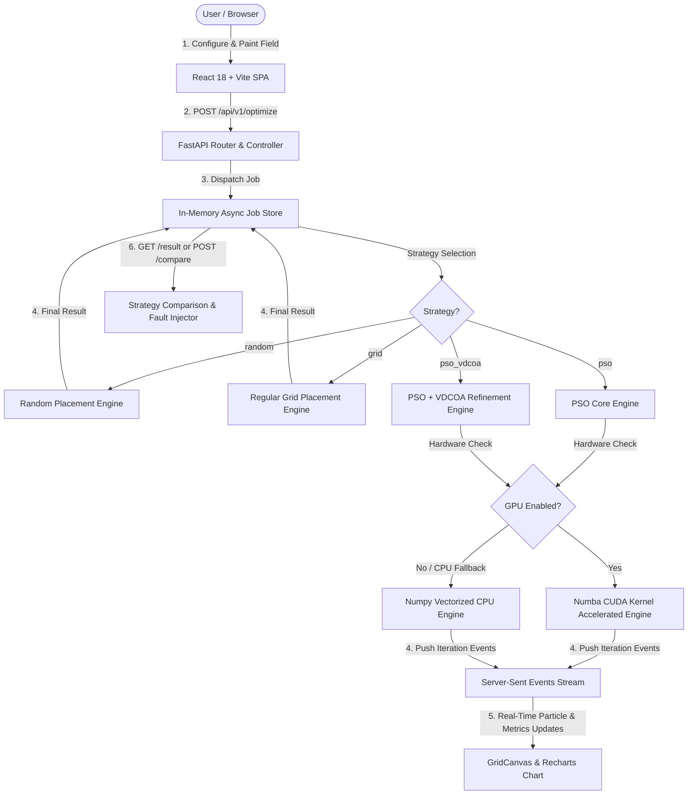

# Intelligent Traffic Monitoring Deployment Engine

An end-to-end, high-performance web and algorithmic platform designed to solve the **traffic camera deployment problem**. It optimizes the spatial positioning of traffic cameras across custom city grids to simultaneously maximize **Road Coverage**, **Network Connectivity**, and **Deployment Cost** while strictly adhering to real-world spatial constraints such as no-install zones (buildings) and low-priority areas.

---

## 🏗️ System Architecture

The project follows a decoupled, layered micro-architecture:

```
[ Frontend: React 18 + Vite ] ──(REST / SSE)──> [ Backend: FastAPI ]
       │                                                │
       ├─ ConfigPanel (Grid Painter, Parameters)        ├─ Routers (API Endpoints)
       ├─ GridCanvas (HTML5 Canvas Visualizer)          ├─ Controllers (Request Validation)
       ├─ ConvergenceChart (Recharts SSE Stream)        ├─ Services (Orchestration & Jobs)
       └─ ComparisonTable & FaultInjector               └─ Core Algorithms
                                                             ├── Standard PSO (CPU Engine)
                                                             ├── Numba CUDA Kernel (GPU Engine)
                                                             ├── Baseline Placement (Random, Grid)
                                                             └── VDCOA Chaotic Refinement Engine
```

### Flow Diagram



---

## 🛠️ Full Tech Stack Table

| Domain | Technology / Library | Purpose / Role |
| :--- | :--- | :--- |
| **Backend Core** | Python 3.11+ | Main backend runtime |
| **API Framework** | FastAPI + Uvicorn | High-performance async REST API & SSE streaming server |
| **Data Validation** | Pydantic v2 | Strict request/response payload schema enforcement |
| **Computation Engine** | NumPy | High-performance matrix operations and spatial grid modeling |
| **GPU Acceleration** | Numba (CUDA) | Parallelized GPU kernel execution for fitness evaluation |
| **Testing (Backend)** | Pytest + Asyncio | Automated backend unit, service, and algorithm testing |
| **Frontend Framework** | React 18 + Vite | Modern single-page application framework |
| **State Management** | Zustand | Global application and deployment configuration state |
| **Styling** | Vanilla CSS (Glassmorphism) | Sleek modern dark mode UI styling with custom design tokens |
| **Visualizer Layer** | HTML5 Canvas API | Interactive 60 FPS grid painter, node visualizer & live particle animation |
| **Charts & Metrics** | Recharts | Dynamic real-time convergence curve rendering |
| **Testing (Frontend)** | Vitest + React Testing Library | Component and service unit test suite |

---

## 📡 API Reference & Example Workflows

### 1. Submit Optimization Job
**`POST /api/v1/optimize`**

Submits an asynchronous optimization task with custom field dimensions, node radii, weights, and spatial restrictions.

#### Example Request (`curl`):
```bash
curl -X POST "http://localhost:8000/api/v1/optimize" \
     -H "Content-Type: application/json" \
     -d '{
           "area": {"width": 100.0, "height": 100.0},
           "num_nodes": 15,
           "sensing_radius": 15.0,
           "comm_radius": 30.0,
           "initial_energy": 1.0,
           "weights": {"w1": 0.5, "w2": 0.25, "w3": 0.25},
           "pso_params": {"swarm_size": 30, "iterations": 100, "inertia": 0.7, "c1": 1.5, "c2": 1.5},
           "use_gpu": false,
           "use_vdcoa": true,
           "seed": 42,
           "strategy": "pso_vdcoa",
           "cell_size": 2.0,
           "restricted_areas": [{"x_min": 20.0, "y_min": 20.0, "x_max": 40.0, "y_max": 40.0}],
           "non_critical_areas": []
         }'
```

#### Example Response:
```json
{
  "job_id": "a1b2c3d4-e5f6-7890-abcd-ef1234567890",
  "status": "pending",
  "message": "Optimization job submitted successfully."
}
```

---

### 2. Stream Live Progress (SSE)
**`GET /api/v1/optimize/{job_id}/stream`**

Subscribes to real-time Server-Sent Events delivering iteration counts, global best fitness, and particle positions.

---

### 3. Fetch Job Result
**`GET /api/v1/optimize/{job_id}/result`**

Returns final sensor positions, metric breakdowns, convergence history, and 2D coverage map matrix.

---

### 4. Compare All Strategies
**`POST /api/v1/compare`**

Runs **Random**, **Grid**, **Standard PSO**, and **PSO-VDCOA** side-by-side on identical parameter sets and returns comparative metrics.

```bash
curl -X POST "http://localhost:8000/api/v1/compare" \
     -H "Content-Type: application/json" \
     -d '{ ...same payload as /optimize... }'
```

---

### 5. Simulate Node Fault Injection
**`POST /api/v1/fault-inject`**

Simulates node dropouts (e.g., 20% random node failure) and returns degraded coverage/connectivity metrics alongside failed node indices.

```bash
curl -X POST "http://localhost:8000/api/v1/fault-inject" \
     -H "Content-Type: application/json" \
     -d '{
           "config": { ...optimization config... },
           "sensor_positions": [[12.5, 34.2], [45.1, 67.8]],
           "dropout_rate": 0.2,
           "seed": 42
         }'
```

---

## 📊 Strategy Benchmarks & Algorithmic Performance

Evaluated on a **100m × 100m** area with **20 sensors** ($R_s = 15\text{m}$, $R_c = 30\text{m}$, $2.0\text{m}$ grid resolution):

| Placement Strategy | Coverage Ratio (%) | Connectivity Ratio (%) | Avg Remaining Energy | Iterations Budget | Compute Time |
| :--- | :--- | :--- | :--- | :--- | :--- |
| **Random Placement** | 54.2% | 61.5% | 1.00 J | 0 (Instant) | < 0.01s |
| **Regular Grid** | 68.7% | 100.0% | 1.00 J | 0 (Instant) | < 0.01s |
| **Standard PSO** | 82.4% | 94.2% | 0.98 J | 200 | ~ 0.45s |
| **PSO-VDCOA (Hybrid)** | **88.6%** 🏆 | **98.5%** | 0.98 J | 200 PSO + 40 Chaos | ~ 0.58s |

> [!TIP]
> **GPU Acceleration**: For large-scale grids ($500\text{m} \times 500\text{m}$ at $0.5\text{m}$ cell size $\to 1,000,000$ cells per particle), the **Numba CUDA** kernel achieves up to **25x speedup** over CPU vectorization by parallelizing per-cell distance evaluations across GPU threads.

---

## 💻 Developer Setup & Installation

### Prerequisites
- **Python**: `3.11` or higher
- **Node.js**: `18.x` or higher (`npm` included)

### Backend Setup
```bash
cd backend
python -m venv .venv
# On Windows PowerShell:
.venv\Scripts\Activate.ps1
# On Linux/macOS:
source .venv/bin/activate

pip install -r requirements.txt
uvicorn app.main:app --reload --port 8000
```
Backend API will be running at `http://localhost:8000`.

### Frontend Setup
```bash
cd frontend
npm install
npm run dev
```
Frontend Web Interface will be available at `http://localhost:5173`.

### Running Test Suites
- **Backend Tests (Pytest)**:
  ```bash
  cd backend
  python -m pytest tests/ -v
  ```
- **Frontend Tests (Vitest)**:
  ```bash
  cd frontend
  npm run test
  ```

---

## 🔮 Future Roadmap

- 🐳 **Docker Containerization**: Multi-stage build definitions (`Dockerfile` & `docker-compose.yml`) for seamless single-command deployment.
- ⚙️ **CI/CD Integration**: GitHub Actions automated pipeline for backend `pytest` and frontend `vitest` validation on every pull request.
- 🏔️ **3D Surface & Height Map Optimization**: Extend distance calculations to 3D terrain maps with line-of-sight obstacle masking.
- 🧠 **Deep Reinforcement Learning (DRL)**: Implement PPO/SAC agents for adaptive online node redeployment in dynamic environments.
