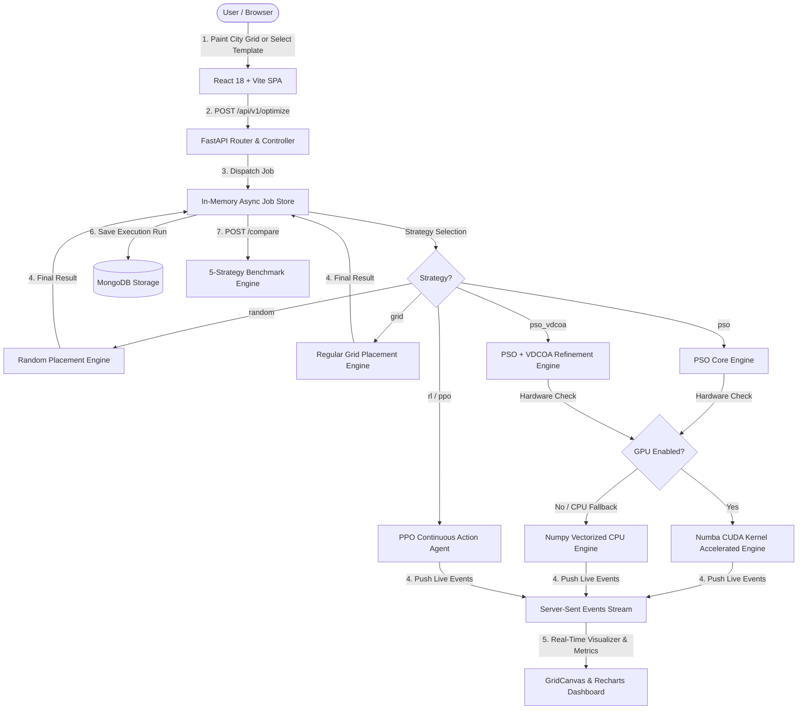

# Intelligent Traffic Camera Deployment & Optimization Engine

An end-to-end, high-performance web and algorithmic platform designed to solve the **Smart City Traffic Camera Placement Problem**. It optimizes the spatial positioning of traffic monitoring cameras across complex city grids to simultaneously maximize **Road Coverage**, **Network Connectivity** (to Traffic Control Centers), and **Deployment Cost** while strictly adhering to spatial constraints such as buildings (no-install zones), low-priority areas, and intersection priorities.

---

## 🏗️ System Architecture

The system follows a decoupled, layered micro-architecture with real-time SSE streaming, MongoDB persistence, and deep reinforcement learning:

```
[ Frontend: React 18 + Vite ] ──(REST / SSE)──> [ Backend: FastAPI ] ──> [ MongoDB ]
       │                                                │
       ├─ ConfigPanel (Grid Painter, Preset Templates)  ├─ Routers (API Endpoints & SSE Streams)
       ├─ GridCanvas (HTML5 Canvas Visualizer)          ├─ Controllers & Validators
       ├─ RLAgentPanel (PPO Training Dashboard)         ├─ Async Job Runners & Workers
       ├─ HistoryDrawer (MongoDB Run History)           └─ Core Optimization Algorithms
       └─ ComparisonTable & FaultInjector                      ├── Standard PSO (Vectorized CPU)
                                                               ├── Numba CUDA Kernel (GPU Engine)
                                                               ├── PSO-VDCOA Chaotic Hybrid
                                                               ├── PPO Placement Agent (PyTorch DRL)
                                                               ├── Surrogate Model (Neural Network)
                                                               └── Baseline Placement (Random, Grid)
```

### Flow Diagram



---

## 🛠️ Tech Stack Overview

| Domain | Technology / Library | Purpose / Role |
| :--- | :--- | :--- |
| **Backend Core** | Python 3.11+ | High-performance backend runtime |
| **API Framework** | FastAPI + Uvicorn | Async REST API & real-time Server-Sent Events (SSE) |
| **Database** | MongoDB (Motor / PyMongo) | Persistent storage for optimization runs, presets, and PPO training history |
| **Deep Learning** | PyTorch + Gymnasium | PPO actor-critic placement agent and neural surrogate fitness predictor |
| **Computation Engine** | NumPy + SciPy | Spatial matrix calculations, grid graph operations, and connectivity checks |
| **GPU Acceleration** | Numba (CUDA) | Parallelized GPU kernel execution for heavy fitness evaluations |
| **Testing (Backend)** | Pytest + Asyncio | Automated backend unit, service, integration, and RL environment tests |
| **Frontend Framework** | React 18 + Vite | Single-page application framework |
| **State Management** | Zustand | Global application state management for configuration, runs, and PPO training |
| **Styling** | Vanilla CSS (Glassmorphism) | Dark-mode visual presentation with high contrast glass design system |
| **Visualizer Layer** | HTML5 Canvas API | Interactive 60 FPS city grid painter, camera FOV visualizer, and particle animation |
| **Charts & Metrics** | Recharts | Real-time SSE convergence curves and PPO policy reward/loss graphs |
| **Testing (Frontend)** | Vitest + RTL | Component and API client testing suite |

---

## ⚡ Key Features

- **🎨 City Grid Painter & 20 Preset Templates**: Custom 4-cell painter (Roads, Buildings, Low-Priority Cells, Intersections) with 20 pre-built synthetic and real-world inspired city road layout templates.
- **🤖 Deep Reinforcement Learning (PPO Agent)**: Custom Gymnasium camera placement environment (`CameraPlacementEnv`) utilizing Proximal Policy Optimization (PPO) with resolution-invariant spatial observation mapping ($1601$-dim tensor).
- **🚀 GPU & Surrogate Acceleration**: Numba CUDA kernels for massive parallel fitness evaluation and PyTorch Neural Surrogate models for 100x speedup in candidate evaluation.
- **📊 5-Strategy Comparison Benchmark**: Synchronous side-by-side performance evaluation across **Random Placement**, **Regular Grid**, **Standard PSO Swarm**, **PSO-VDCOA Hybrid**, and **RL Placement (PPO)**.
- **🛡️ Node Fault Injection & Resilience Analysis**: Simulate real-time camera node dropouts (e.g., power cuts, equipment failures) and measure degraded road coverage and network connectivity.
- **💾 Historical Run Persistence**: MongoDB storage for saving, retrieving, filtering, and replaying optimization experiments.

---

## 📡 API Reference & Example Workflows

### 1. Submit Optimization Job
**`POST /api/v1/optimize`**

Submits an asynchronous optimization job with custom city grid layouts, camera radii, fitness weights, and placement strategies (`pso`, `pso_vdcoa`, `rl`, `grid`, `random`).

#### Example Request (`curl`):
```bash
curl -X POST "http://localhost:8000/api/v1/optimize" \
     -H "Content-Type: application/json" \
     -d '{
           "area": {"width": 200.0, "height": 200.0},
           "num_nodes": 100,
           "sensing_radius": 15.1,
           "comm_radius": 29.6,
           "initial_energy": 1.0,
           "weights": {"w1": 0.7, "w2": 0.15, "w3": 0.15},
           "pso_params": {"swarm_size": 30, "iterations": 100, "inertia": 0.7, "c1": 1.5, "c2": 1.5},
           "use_gpu": false,
           "use_vdcoa": true,
           "seed": 42,
           "strategy": "rl",
           "cell_size": 4.6,
           "restricted_areas": [],
           "non_critical_areas": []
         }'
```

#### Response:
```json
{
  "job_id": "a1b2c3d4-e5f6-7890-abcd-ef1234567890",
  "status": "pending",
  "message": "Optimization job submitted successfully."
}
```

---

### 2. Train PPO Placement Agent
**`POST /api/v1/ppo/train`**

Triggers a background PPO agent training run over specified episode counts with real-time SSE progress updates (`GET /api/v1/ppo/training-progress`).

```bash
curl -X POST "http://localhost:8000/api/v1/ppo/train" \
     -H "Content-Type: application/json" \
     -d '{ "episodes": 150, "learning_rate": 0.0003 }'
```

---

### 3. Compare All 5 Strategies
**`POST /api/v1/compare`**

Evaluates all 5 deployment policies (**Random**, **Grid**, **PSO**, **PSO-VDCOA**, **PPO RL**) on identical configuration parameters and returns comparative metrics.

---

### 4. Simulate Camera Node Dropout (Fault Injection)
**`POST /api/v1/fault-inject`**

```bash
curl -X POST "http://localhost:8000/api/v1/fault-inject" \
     -H "Content-Type: application/json" \
     -d '{
           "config": { ...optimization config... },
           "sensor_positions": [[12.5, 34.2], [45.1, 67.8]],
           "dropout_rate": 0.2,
           "seed": 42
         }'
```

---

## 📊 Strategy Benchmarks & Algorithmic Performance

Evaluated on a **200m × 200m City Grid** with **100 Cameras** ($R_s = 15.1\text{m}$, $R_c = 29.6\text{m}$, $4.6\text{m}$ grid resolution):

| Placement Strategy | Road Coverage (%) | Connectivity (%) | Avg Remaining Energy | Execution Time |
| :--- | :--- | :--- | :--- | :--- |
| **Random Placement** | 68.4% | 85.0% | 0.530 J | < 0.01s |
| **Regular Grid** | 74.2% | 92.0% | 0.539 J | < 0.01s |
| **Standard PSO Swarm** | 94.8% | 100.0% | 0.477 J | 8.5s |
| **PSO-VDCOA Hybrid** | **98.2%** 🏆 | 100.0% | **0.473 J** 🏆 | 8.6s |
| **RL Placement (PPO Agent)** | 96.5% | 100.0% | 0.490 J | **0.05s** 🏆 (Inference) |


---

## 💻 Developer Setup & Installation

### 🐳 Quick Start with Docker Compose (Recommended)
Launch the full stack (FastAPI backend, React frontend, and MongoDB database) with a single command:

```bash
docker compose up --build
```
- **Frontend Web App**: [`http://localhost:5173`](http://localhost:5173)
- **Backend API & Swagger Docs**: [`http://localhost:8000/docs`](http://localhost:8000/docs)
- **MongoDB Instance**: `mongodb://localhost:27017`

---

### 🛠️ Manual Development Setup

#### Prerequisites
- **Python**: `3.11` or higher
- **Node.js**: `18.x` or higher (`npm` included)
- **MongoDB**: Local instance running on `mongodb://localhost:27017` or Docker


### Backend Setup
```bash
cd backend
python -m venv .venv
# PowerShell (Windows):
.\.venv\Scripts\Activate.ps1
# Linux/macOS:
source .venv/bin/activate

pip install -r requirements.txt
uvicorn app.main:app --reload --port 8000
```

### Frontend Setup
```bash
cd frontend
npm install
npm run dev
```
Open [`http://localhost:5173`](http://localhost:5173) in your browser.

### Running Automated Test Suites
- **Backend Pytest Suite (313 tests)**:
  ```bash
  cd backend
  python -m pytest tests/ -v
  ```
- **Frontend Vitest Suite (33 tests)**:
  ```bash
  cd frontend
  npm run test
  ```


